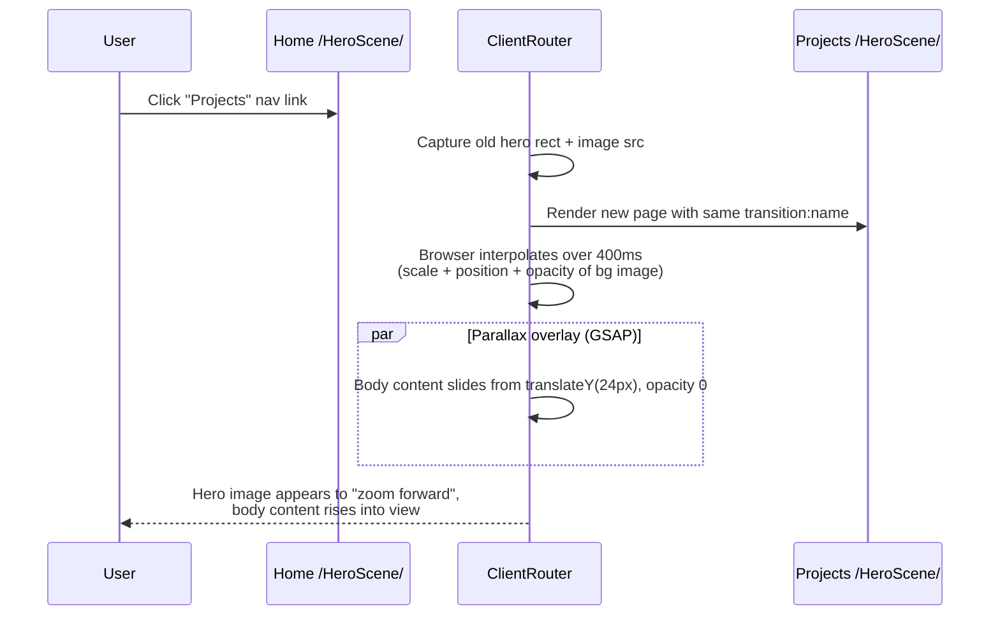

# Animation Options — "Deeper into the Scene"

> Inputs: [`redesign/audit/visual-baseline.md`](audit/visual-baseline.md),
> [`redesign/design-spec.md`](design-spec.md), and the user's directive
> ("could we somehow make it look like a cool screen and each page takes
> you deeper into the screen using animations to go to a image in the
> background"). API claims verified against Astro 6.3.1 docs via
> `user-context7` MCP.

---

## TL;DR — recommendation

**Approach (A): Astro 6 `<ClientRouter />` View Transitions + GSAP for
the parallax / scene-dolly layer. No React added.**

Reasons:
- The user's "go deeper into a scene" idea is **exactly** what shared-element
  view transitions do natively. The hero photographic backdrop on each page
  carries `transition:name="hero-scene"`; on navigation, the browser
  morphs the old hero into the new one. Free, ~0 lines of JS.
- GSAP layered on top adds the parallax of body content past the hero
  and respects `prefers-reduced-motion`.
- Bundle cost: GSAP core is ~71 KB minified (~25 KB gzipped). Acceptable
  on GH Pages cold-load.
- Adds **no React, no `@react-three/fiber`, no Theatre.js**, so the
  Astro build pipeline stays a static-site pipeline.
- Compatible with the May 20 deadline. Implementation budget: 1 commit.
- Works under the project-page subpath `/cisc480-portfolio/`.

Approaches (B) and (C) are evaluated below for completeness; both are
deferred as "Summer 2026 follow-up" if the redesign branch later evolves
into a portfolio refresh.

---

## Verified API surface (Astro 6.3.1)

```astro
---
// src/layouts/BaseLayout.astro
import { ClientRouter } from 'astro:transitions';
---
<html>
  <head>
    <ClientRouter />
  </head>
  <body>
    <slot />
  </body>
</html>
```

```astro
---
// src/components/HeroScene.astro
import { fade } from 'astro:transitions';
const { bgImage, title, eyebrow } = Astro.props;
---
<section class="hero-scene" transition:name="hero-scene">
  
  <div class="hero-scene__veil" />
  <header class="hero-scene__copy" transition:animate={fade({ duration: '320ms' })}>
    {eyebrow && <p class="hero-scene__eyebrow">{eyebrow}</p>}
    <h1 class="hero-scene__title">{title}</h1>
  </header>
</section>
```

Per the docs, identical `transition:name` values across pages cause the
browser to **morph that single element across the navigation** —
position, size, and any animatable CSS properties interpolate over the
transition duration.

When the user clicks a project thumbnail on `/projects/`, both the
thumbnail (`transition:name="hero-scene-bg"`) and the next page's hero
backdrop carry the same name → the browser interpolates the thumbnail
to grow into the next page's full hero. That **is** "deeper into the
scene."

---

## How approach (A) achieves the visual goal



For project-thumbnail-into-hero (the more cinematic case), each
`<ProjectCard>`'s media gets a unique name:

```astro

```

The destination page (a project-detail page or an anchor scroll into the
in-page section) carries the same `transition:name`. Browser morphs
the small thumbnail into the larger position. Combined with GSAP fading
the rest of the projects list down/out, the visual reads as "the
thumbnail expanded into the next view."

---

## GSAP layer (vanilla, no React)

```js
// src/scripts/scene.js  (loaded once via BaseLayout)
import gsap from 'gsap';

document.addEventListener('astro:page-load', () => {
  if (window.matchMedia('(prefers-reduced-motion: reduce)').matches) return;

  // Body content lift on each page enter
  gsap.from('main > :not(.hero-scene)', {
    y: 24,
    opacity: 0,
    duration: 0.45,
    ease: 'power2.out',
    stagger: 0.05,
  });

  // Hero parallax: bg image scales subtly as user scrolls past hero
  const heroBg = document.querySelector('.hero-scene__bg');
  if (heroBg) {
    let scrollY = 0;
    const onScroll = () => {
      scrollY = window.scrollY;
      gsap.to(heroBg, {
        scale: 1 + Math.min(scrollY / 1200, 0.15),
        y: scrollY * 0.25,
        duration: 0.6,
        overwrite: 'auto',
      });
    };
    window.addEventListener('scroll', onScroll, { passive: true });
    document.addEventListener('astro:before-swap', () => {
      window.removeEventListener('scroll', onScroll);
    }, { once: true });
  }
});
```

`astro:page-load` is the View Transitions lifecycle hook that fires after
each navigation completes. We re-bind on every page-load, and tear down
the scroll listener on `astro:before-swap` to avoid leaks.

---

## Approach (B) — *deferred* — single React island for a 3D hero

Adds:
- `@astrojs/react`
- `react`, `react-dom`
- `@react-three/fiber`
- `@react-three/drei`

The hero becomes a single `<Hero3D client:load />` React island that
renders a Three.js scene with a camera dolly between pages. Cinematic
upside, but:
- Adds ~300+ KB to the bundle.
- Requires WebGL (graceful degradation needed).
- Mobile performance has to be measured and likely capped.
- Doesn't fit before May 20.
- Doesn't actually buy more than (A) for the "page is deeper into a
  scene" feel — view transitions already produce that read.

Reserve as a Summer 2026 follow-up.

## Approach (C) — *deferred* — full R3F + Theatre.js continuous scene

Each page becomes a different camera position in one persistent 3D
scene that never unmounts. Theatre.js scripts the camera path. This is
the "every page is a different room" version. Spectacular, but:
- Requires re-architecting `BaseLayout.astro` to host a persistent
  WebGL canvas behind every route.
- Three.js + Theatre.js + R3F + drei = ~600 KB bundle minimum.
- Months of design iteration to make it not feel gimmicky.
- Wholly inappropriate for a deadline-driven CISC480 portfolio.

Note this exists for completeness; do not implement.

---

## Bundle / perf budget for approach (A)

| Item | Size (min/gz) | Notes |
|---|---:|---|
| Astro 6 core (already shipped) | ~6 KB / 2 KB | view-transitions polyfill is ~3 KB gz extra |
| GSAP core | ~71 KB / ~25 KB | tree-shaken; only `gsap` core, no plugins |
| Custom scene.js | ~1 KB | the snippet above |
| **Total added by redesign** | **~75 KB / ~28 KB gz** | Acceptable. |

GSAP plugins to **avoid** in this round (each adds 10–25 KB):
- ScrollTrigger
- Flip
- Draggable
- SplitText

If we want scroll-driven parallax beyond the simple `scrollY` listener
above, ScrollTrigger is the right pick — but defer until needed.

---

## Accessibility checklist

- [x] `prefers-reduced-motion` short-circuits all GSAP animations
      (handled in scene.js).
- [x] Astro `<ClientRouter />` itself respects the user's reduced-motion
      preference (browser-level fallback to instant nav).
- [x] All hero copy uses `transition:animate={fade(...)}`, not motion.
- [x] Background images carry `aria-hidden="true"` and empty `alt`.
- [x] Focus order is preserved across nav (browser's view-transitions
      contract).

---

## What lands in Phase 4 commit 6

- `src/layouts/BaseLayout.astro`: `<ClientRouter />` in `<head>`.
- `src/components/HeroScene.astro`: `transition:name="hero-scene"`
  + `transition:name="hero-scene-bg"` + `fade()` on the copy.
- `src/components/ProjectCard.astro`: `transition:name={\`project-\${id}\`}`
  on the image.
- `src/scripts/scene.js`: GSAP body-lift + hero parallax, registered to
  `astro:page-load`.
- `package.json`: add `gsap` dep.
- `astro.config.mjs`: no change required (View Transitions is built in).

That's one commit. Done.
